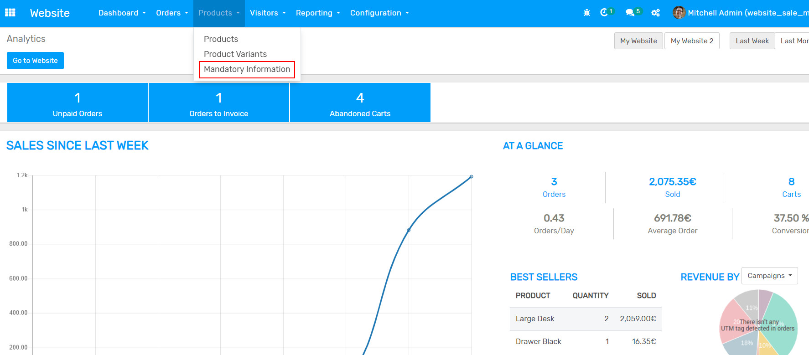
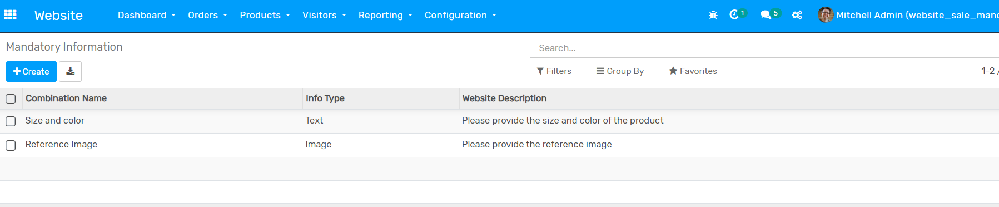
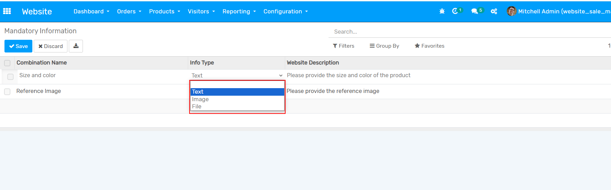
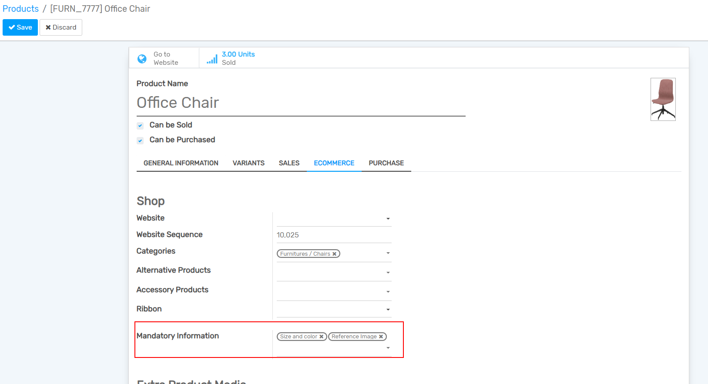
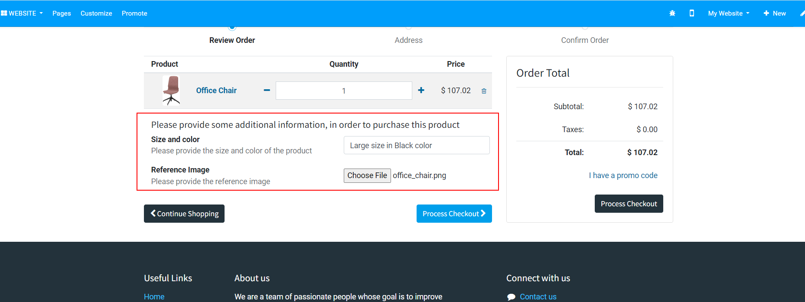
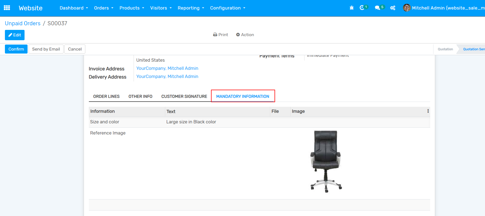

================================================================
Website Sale Mandatory Information
================================================================

Website Sale Mandatory Information is an Odoo extended module that defines the mandatory information, provided by customers when purchasing a product from the webshop.

.. role:: raw-html(raw)
    :format: html

:raw-html:`
`

**Table of contents**

.. contents::
   :local:

Installation
================================================================

**To install this, follow below steps:**

* Just simply mount this module as Odoo's custom module

* Now, Install the module in Odoo from **Main Apps** section.

Usage
================================================================

**How to use this module:**

* Go to **Website** -> click on **Products** menu -> click on **Mandatory Information** menu

* You can create or edit **Mandatory Information** here

* You can define three types of mandatory information

* You can configure this mandatory information in the Products

* The user must provide the mandatory information when purchasing configured products from the webshop.

* Add the product to your cart, go to the cart, and here you can see the mandatory information input options

* Once the product has been purchased, the mandatory information will be available in the respective quotation or sale order

Dependent modules
================================================================

* website_sale

Change logs
================================================================

* ``Added`` Website Sale Mandatory Information module

Support
================================================================

`2BIT AG <https://www.2bit.ch/>`_